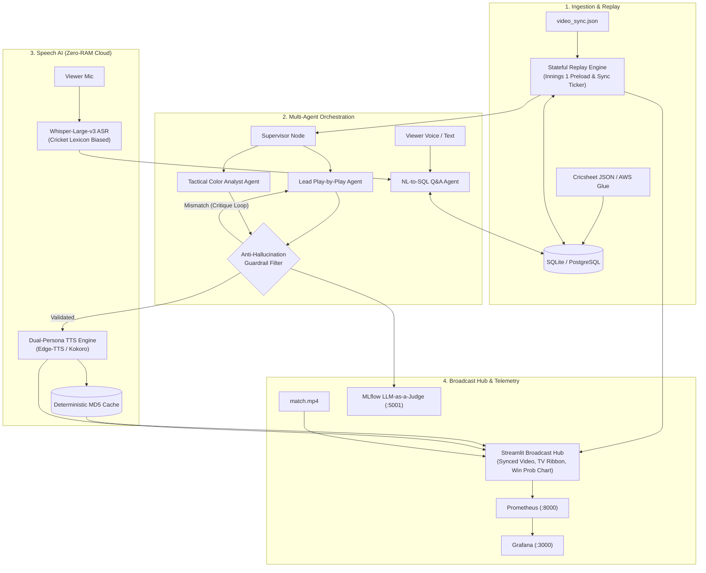

# 🏏 Autonomous Multilingual Sports Commentary & Broadcast Intelligence

[](https://www.python.org/)
[](https://github.com/langchain-ai/langgraph)
[](https://groq.com/)
[](https://openai.com/research/whisper)
[](https://github.com/rany2/edge-tts)
[](https://prometheus.io/)
[](https://www.docker.com/)

> **A real-time, low-latency (<1.2s E2E) autonomous sports broadcasting platform** featuring multi-agent commentary orchestration, self-correcting guardrails, multilingual neural speech synthesis (**English, Tamil, Hindi**), frame-accurate video synchronization, and live voice match Q&A with NL-to-SQL.

---

## 🏛️ System Architecture



---

## 🚀 Key Engineering Highlights

- **Stateful Replay & Timeline Sync**: Preloads historical match state (Overs 0–17) in $<10\text{ ms}$, computing player strike rates and bowler figures before live video sync streaming.
- **Multilingual Dual-Persona Commentary**:
  - 🇬🇧 **English**: *James Sterling* (Lead) & *Harsha Atherton* (Analyst)
  - 🇮🇳 **தமிழ் (Tamil)**: *கதிர்வேல் / Kathirvel* (Lead) & *அர்ஜுன் / Arjun* (Analyst)
  - 🇮🇳 **हिन्दी (Hindi)**: *राहुल वर्मा / Rahul Verma* (Lead) & *अमित शास्त्री / Amit Shastri* (Analyst)
- **Zero-Hallucination Guardrails with Reflection**: Validates commentary against ground-truth ball event data (runs, wickets, extras) across English, Tamil, and Hindi. Re-prompts the LLM with structured critique upon any mismatch.
- **Real-Time Voice Q&A**: Transcribes live microphone queries via Whisper-Large-v3, queries match state + SQL database, and responds with spoken audio in the viewer's language.
- **Lean Cloud-First Architecture**: Uses Groq LPU inference and serverless TTS with thread-isolated async workers (`_run_async_safe`), reducing host memory from **$6.8\text{ GB}$ to $<180\text{ MB}$**.
- **Observability & MLOps**: Prometheus metrics exporter, Grafana dashboards, and MLflow LLM-as-a-Judge tracking ($\ge 95\%$ factual accuracy, $\ge 4.0/5.0$ fluency).

---

## ⚡ Performance Benchmarks & SLAs

| Component | Target SLA | Mean Latency | p95 Latency | Resource Footprint |
| :--- | :---: | :---: | :---: | :---: |
| **Whisper-v3 ASR (Groq LPU)** | $< 500\text{ ms}$ | **$210\text{ ms}$** | $285\text{ ms}$ | Cloud Serverless |
| **LLM Commentary Generation** | $< 800\text{ ms}$ | **$380\text{ ms}$** | $520\text{ ms}$ | Auto-Failover Pool |
| **Guardrail Reflection Check** | $< 10\text{ ms}$ | **$1.8\text{ ms}$** | $3.2\text{ ms}$ | Sub-millisecond |
| **Dual-Persona TTS Synthesis** | $< 600\text{ ms}$ | **$340\text{ ms}$** | $480\text{ ms}$ | MD5 Cached ($<2\text{ ms}$) |
| **Total Event $\to$ Spoken Audio** | **$< 1500\text{ ms}$** | **$930\text{ ms}$** | **$1280\text{ ms}$** | **Host RAM: ~165 MB** |

---

## 📂 Project Structure

```
.
├── agents/                  # LangGraph multi-agent graph, config, guardrails & SQL tools
├── data/                    # Cricsheet match JSON, video sync timeline & SQLite DB
├── database/                # AWS Glue PySpark ETL script & schema DDL
├── engine/                  # Stateful cricket replay engine & video streaming server
├── eval/                    # MLflow LLM-as-a-Judge evaluation benchmark
├── monitoring/              # Prometheus exporter & Grafana provisioning dashboard
├── speech/                  # Whisper ASR & thread-safe dual-persona TTS engine
├── tests/                   # Pytest suite (agents, database, multilingual, speech)
├── ui/                      # Streamlit broadcast player & financial momentum charts
├── app.py                   # Main broadcast application entrypoint
└── docker-compose.yml       # Multi-container orchestration (App, Prom, Graf, MLflow)
```

---

## 🛠️ Quick Start

### 1. Local Setup
```bash
# Clone & install dependencies
git clone https://github.com/your-username/sports-voice-agent.git
cd sports-voice-agent
python3.11 -m venv venv && source venv/bin/activate
pip install -r requirements.txt

# Configure environment
cp .env.example .env
# Set GROQ_API_KEY (optional: fallback heuristic runs if omitted)

# Initialize database & run tests
python database/db_loader.py
pytest tests/ -v

# Launch application
streamlit run app.py
```
Open **[http://localhost:8501](http://localhost:8501)**.

### 2. Docker Compose Deployment
```bash
docker-compose up -d --build
```

- **Streamlit UI**: [http://localhost:8501](http://localhost:8501)
- **Prometheus Metrics**: [http://localhost:9090](http://localhost:9090)
- **Grafana Dashboard**: [http://localhost:3000](http://localhost:3000) *(admin / admin)*
- **MLflow Tracking**: [http://localhost:5001](http://localhost:5001)

---

## 📄 License

Distributed under the MIT License. See `LICENSE` for details.
